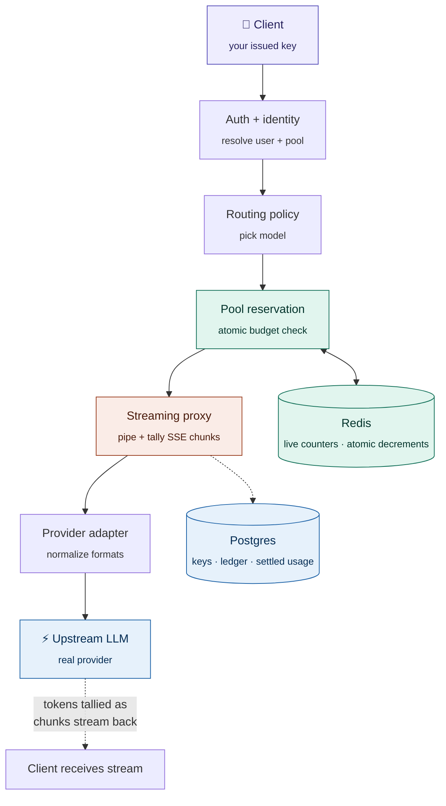
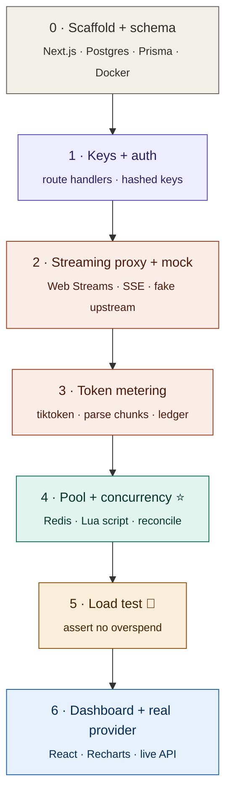

<div align="center">

# 🪙 Token Gateway

**An authenticated, metered, budget-enforcing proxy for LLM APIs.**

Sits in front of one or more LLM providers — authenticates requests with keys *you* issue, enforces a shared token budget under concurrent load, and streams responses back while metering every token.

`TypeScript` · `Next.js` · `Rust` · `Postgres` · `Redis`

</div>

---

## What it does

You give a team one shared token budget. Members hit the gateway with their own keys. The gateway checks the budget, forwards the request to the real provider, streams the answer back, and counts tokens as they flow — keeping a shared pool from ever overspending, even when everyone fires at once.

> **Not** a token-resale marketplace. This is **internal budget-pooling infrastructure** — one account, one budget, shared across members. Stays on the right side of provider terms of service.

---

## The interesting problems

This isn't a CRUD app. The engineering lives in four places:

| Problem | Why it's hard |
|---|---|
| **Streaming proxy** | Forward SSE chunks *as they arrive* while parsing them to count tokens — no buffering the full response. |
| **Atomic reservation** | Many requests hit one budget at once. A naive check-then-decrement double-spends. Fixed with an atomic Redis Lua script. |
| **Cache ↔ store consistency** | A fast Redis counter gates the hot path; a durable Postgres ledger is the source of truth. Keeping them coherent is real work. |
| **Partial failure** | Client disconnects mid-stream? Pool drains mid-generation? Both still have to settle correctly. |

---

## Architecture

The request path. Each layer adds exactly one responsibility.

<div align="center">



</div>

**Why two data stores?** Redis is the *bouncer* — fast, atomic, in-memory, counts heads in real time. Postgres is the *accounting books* — durable, transactional, the record you rebuild from. Each does the half it's good at.

---

## How the budget stays correct under load

The core trick: you can't know an LLM's output length up front, so you can't decrement the exact cost. Instead — **reserve a ceiling, then reconcile down.**

1. **Reserve** a conservative estimate (`input + max_tokens`) via an atomic Redis Lua script. If it won't fit, reject *before* forwarding.
2. **Stream + meter** the response as usual.
3. **Reconcile** when the stream closes: release `estimate − actual` back to the pool.

Because the Lua script runs indivisibly inside Redis, two simultaneous requests can't both "see room" — the second sees the first's decrement. That single property is the whole fix for the race.

---

## Build order

Each phase **runs and is testable** before the next begins. No big-bang integration.

<div align="center">



</div>

> **⭐ Phase 4** is the centerpiece — atomic budget reservation. **🧪 Phase 5** proves it: hammer a near-empty pool with concurrent requests and watch the naive version overspend while the atomic version holds.

Phases 0–3 are the spine (low-risk, concrete). Phase 4 has the conceptual teeth. Phases 5–6 turn it from a class project into a portfolio piece.

---

## Tech stack

| Layer | Tech | Role |
|---|---|---|
| Control plane | **Next.js · TypeScript** | Auth, key management, dashboard |
| Data plane | **Rust · Tokio · Axum** | Low-latency streaming proxy + token metering |
| Durable store | **Postgres · Prisma** | Users, keys, settled usage ledger |
| Fast gate | **Redis + Lua** | Atomic budget reservation on the hot path |
| Load testing | **k6** | Proves concurrency correctness |
| Charts | **React · Recharts** | Per-user / per-pool usage over time |
| Local infra | **Docker Compose** | Reproducible Postgres + Redis |

> The **control plane / data plane split** is deliberate: TypeScript handles users and UI; a standalone Rust service handles the latency-sensitive streaming and metering. The seam between them is itself a design decision worth defending.

---

## Getting started

```bash
# bring up Postgres + Redis
docker compose up -d

# install + migrate
npm install
npx prisma migrate dev

# run the control plane
npm run dev

# run the Rust data plane
cargo run --release
```

---

<div align="center">
<sub>Built as a study in streaming, atomic concurrency, and cache/store consistency.</sub>
</div>
